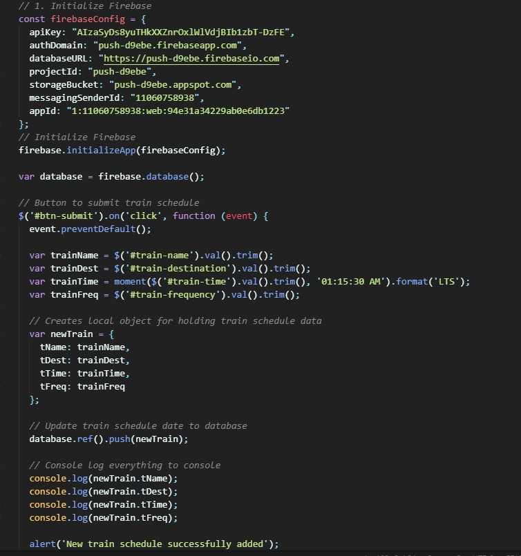
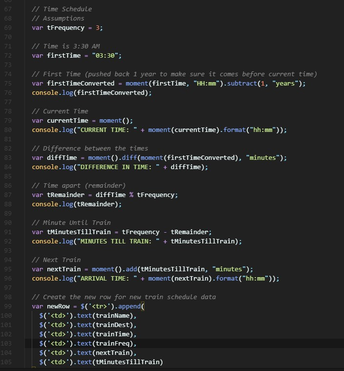
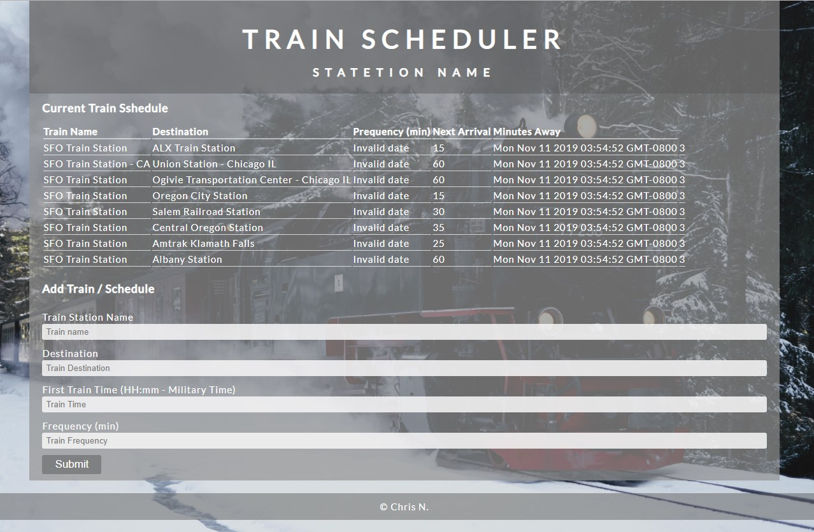

# TrainScheduler
Homework assignment - Create a train schedule application that incorporates Firebase to host arrival and departure data.
Requirement/Spec - User should be able to add and submit 
1. Train Station Name
2. Destination
3. First Train Time -- In military time
4. Frequency -- in minutes

Code - calculate when the next train will arrive: this should be relative to the current time.
Users - from many different machine must be able to view the same times
Style - Styling and theme are completely up to creativities.

## User Features
1. User can input Train station name
2. Input train destination
3. Input Train Time
4. Input Frequency Schedule
5. Submit and store date in database

## Technologies Used
* HTML, CSS for frontend design
* Javascript for backend logic
* jQuery for DOM manipulation
* Moment.js for time/date convertion
* FireBase for cloud data storage

## Test out the app
[click to run](https://monksedo.github.io/TrainScheduler/)

## CSS/Javascript Snippet
### Core Firebase Connection 

### Code block for schedule time conversion

## App Screenshot
### Main UI

